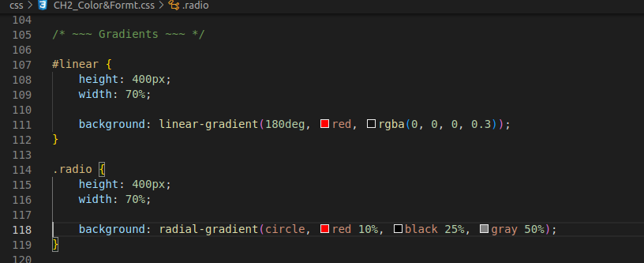
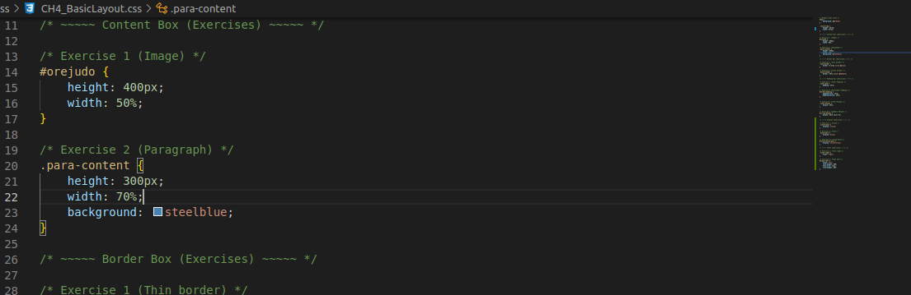

# CSS Course
Repository containing the exercises done in [CSS Tutorial - Zero to Hero (Complete Course)](https://www.youtube.com/watch?v=1Rs2ND1ryYc)

## Chapter 1: Selectors & Properties

## Chapter 2: Coloring & Formatting

## Chapter 3: Fonts & Text Manipulation

## Chapter 4: Basic Layout

